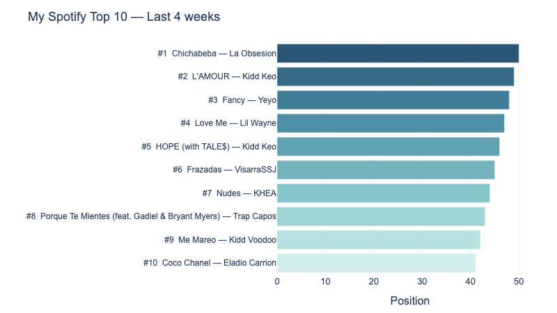

# Spotify Top Tracks 


---



---

## What it does

I was curious about my own listening habits, so I built a small data pipeline around it. Every Monday it connects to the Spotify API, pulls my top tracks from the last 4 weeks, cleans the data with Pandas, stores it in a SQLite database, and generates the chart above with Plotly. The whole thing runs automatically via GitHub Actions

---

## Tech stack

Python · Pandas · SQLite · Plotly · Spotipy · GitHub Actions

---

## Automated updates

Every Monday at 9:00 GitHub Actions kicks off the pipeline and commits the fresh chart and data back to the repo. The badge above turns red if something breaks.

---

## Run it locally
```bash
git clone https://github.com/ElSenpaiSAMA/spotify-top-tracks
cd spotify-top-tracks
pip install -r requirements.txt
cp .env.example .env   # add your Spotify credentials here
python main.py
```

You'll need a Spotify app for the credentials — takes 2 minutes at [developer.spotify.com](https://developer.spotify.com).
